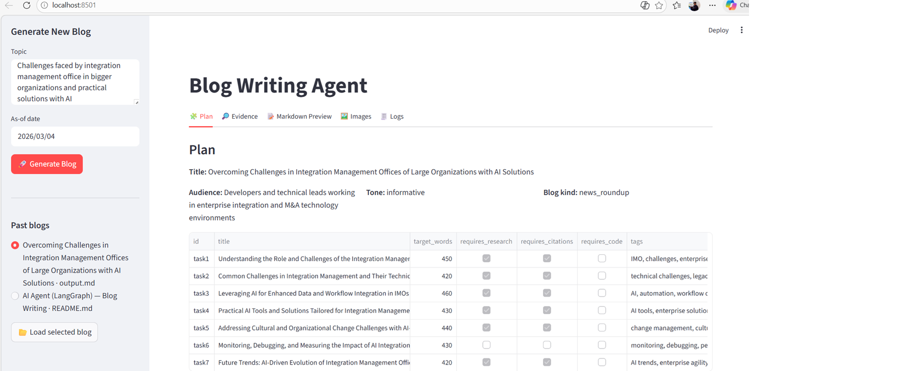
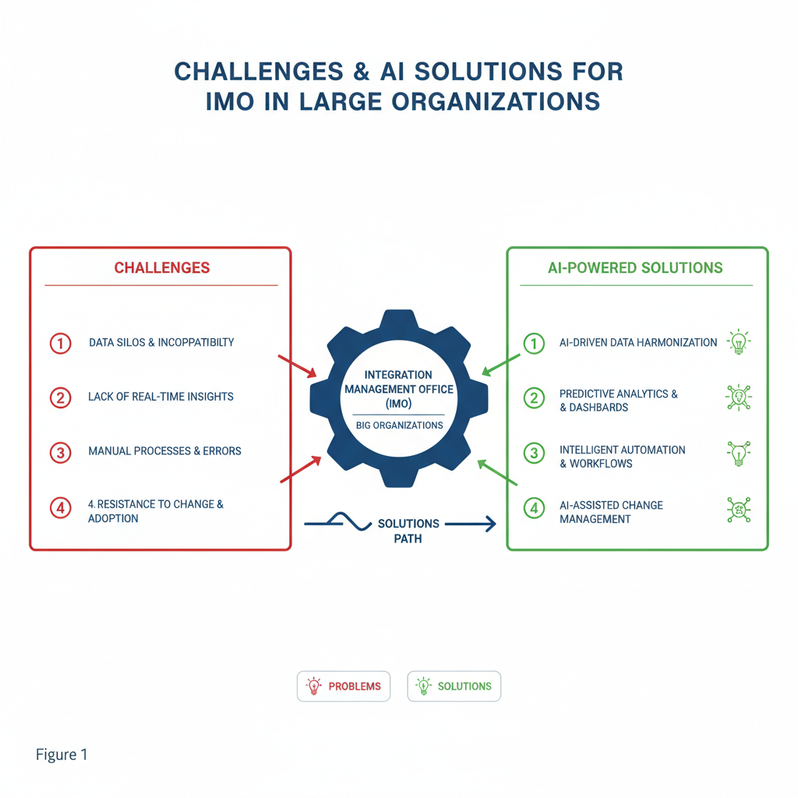
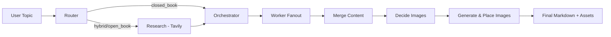

# LangGraph AI Blog Writing Agent (Mini Project)

An interview-ready mini project that turns a topic into a structured technical blog using a **multi-agent LangGraph workflow**, optional live research, and automated image generation.

## 🚀 30-second overview

**Problem:** Writing quality technical blogs takes planning, research, structure, and visuals.  
**Solution:** A multi-agent pipeline that automates end-to-end blog creation.  
**Input:** Topic + as-of date.  
**Output:** Markdown blog (`output.md`) + generated images (`images/`) + downloadable bundle from UI.

### What this demonstrates

- Multi-agent orchestration with LangGraph (router → research → planner → workers → reducer)
- Structured outputs using Pydantic models
- Retrieval-augmented writing with Tavily (when needed)
- Image enrichment with Gemini + deterministic SVG fallback
- Productized UX via Streamlit (plan/evidence/preview/images/logs tabs)

## 🖥️ UI preview (for interview demo)




## 📝 Generated blog sample

- Sample generated markdown:  
   [`images/blog/overcoming_challenges_in_integration_management_offices_of_large_organizations_with_ai_solutions.md`](images/blog/overcoming_challenges_in_integration_management_offices_of_large_organizations_with_ai_solutions.md)
- Current latest output:  
   [`output.md`](output.md)

Example generated visual asset:



## 🧠 Architecture at a glance

Detailed architecture diagram (recommended for interview walkthrough):  
[`images/architecture/langgraph_blog_architecture.md`](images/architecture/langgraph_blog_architecture.md)



## 🛠️ Tech stack

- **Language:** Python 3.11+
- **Agent orchestration:** LangGraph
- **LLM orchestration:** LangChain
- **Models:** OpenAI (`gpt-4.1-mini` / `gpt-4o-mini`), Gemini image model
- **Research:** Tavily search
- **UI:** Streamlit + Pandas
- **Validation:** Pydantic

## ⚡ Quick start

### 1) Setup

```powershell
python -m venv .venv
. .\.venv\Scripts\Activate.ps1
pip install -r requirements.txt
```

> If you want to run the Streamlit UI and image generation but don't already have them installed, add: `streamlit`, `pandas`, `tavily-python`, `google-genai`.

### 2) Configure environment variables

Create a `.env` file in project root:

```dotenv
OPENAI_API_KEY="your_openai_api_key_here"
TAVILY_API_KEY="your_tavily_api_key_here"            # optional for research mode
GOOGLE_API_KEY="your_google_ai_api_key_here"         # optional for AI image generation

# Optional observability
LANGCHAIN_TRACING_V2=true
LANGCHAIN_ENDPOINT="https://api.smith.langchain.com"
LANGCHAIN_API_KEY="your_langsmith_api_key_here"
LANGCHAIN_PROJECT="langgraph-blog-agent"
```

### 3) Run

CLI workflow:

```powershell
python 2_research_blog_writing_agent.py
```

Streamlit demo app (recommended for interview):

```powershell
streamlit run 3_research_blog_writing_agent_frontend.py
```

## 📂 Project structure

- `1_basic_blog_writing_agent.py` — baseline planner → workers → reducer flow
- `2_research_blog_writing_agent.py` — full research + image pipeline
- `research_blog_wriging_agent_backend.py` — backend app used by Streamlit frontend
- `3_research_blog_writing_agent_frontend.py` — interactive UI for generation and downloads
- `images/ui/` — UI screenshots for showcase
- `images/blog/` — saved blog outputs/screenshots
- `output.md` — latest generated blog output

## ✅ Current status

- End-to-end generation works with markdown + visual assets.
- UI screenshots and sample output are included for quick reviewer scan.
- `.env` is git-ignored (secrets are not committed).
