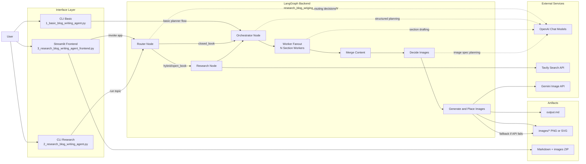

# LangGraph Blog Writing Agent - Architecture Diagram

This diagram represents the end-to-end architecture of the project, including entry points, LangGraph pipeline nodes, external services, and generated artifacts.

## Notes

- `closed_book` skips web research and moves directly to planning.
- `hybrid/open_book` uses Tavily evidence before planning.
- Image generation first attempts Gemini and falls back to local SVG diagrams when needed.
- Final markdown is written to `output.md`, with images in `images/`.
