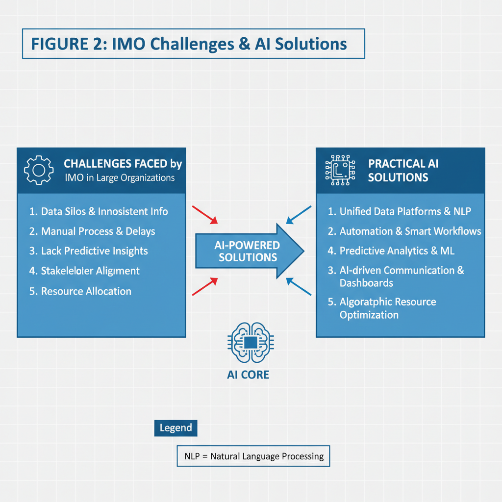
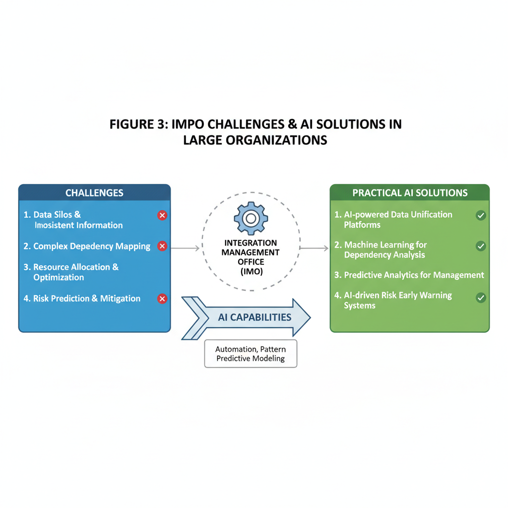

# Overcoming Challenges in Integration Management Offices of Large Organizations with AI Solutions

## Understanding the Role and Challenges of the Integration Management Office (IMO) in Large Organizations

The Integration Management Office (IMO) plays a pivotal role during mergers, acquisitions, and large-scale enterprise integrations. Its core responsibility is to ensure the seamless alignment of multiple organizational dimensions—corporate culture, IT systems, employee transitions, and customer experience—to enable a smooth, effective integration process.

### Core Responsibilities of the IMO

- **Corporate Culture Alignment:** The IMO drives cultural integration by facilitating shared values and work norms between merging entities. This helps mitigate employee uncertainty and preserves workforce morale.
- **IT Systems Consolidation:** Managing legacy system compatibility, data migration, and service continuity are critical IMO functions. Coordinating technology integration avoids operational disruption and data silos.
- **Employee Transitions:** The IMO oversees workforce realignment, including role reassignments, retention plans, and communication strategies that support people through change.
- **Customer Experience Management:** Ensuring consistent service delivery during integration protects customer satisfaction and retention, a vital concern when organizational structures shift.

### Common Challenges Faced by the IMO

The integration process often encounters significant hurdles:

- **Timeline Pressure:** Integration deadlines are typically aggressive, compressing careful coordination and testing phases.
- **Legacy System Incompatibility:** Differing technology stacks create complex integration puzzles, requiring bespoke solutions or middleware.
- **Complex Stakeholder Management:** Multiple internal and external stakeholders, each with unique goals and communication styles, necessitate delicate coordination ([Source](https://www.projectmanagertemplate.com/post/integration-management-office-a-comprehensive-guide)).

### Organizational Barriers to Integration

Beyond technical and project challenges, the IMO must navigate behavioral and leadership dynamics:

- **Resistance to Change:** Employees often resist shifts in their roles, reporting lines, or company culture. This friction can stall integration efforts.
- **Need for Strong Leadership:** Effective integration requires decisive leadership that can champion change and resolve conflicts swiftly.
- **Transparent Communication:** Clear, frequent updates about goals, progress, and impacts reduce uncertainty and align stakeholder expectations ([Source](https://www.walkme.com/blog/barriers-to-organizational-change/)).

### Impact on Integration Success and Continuity

Failure to manage these challenges directly affects integration outcomes:

- Integration delays increase costs and risk customer attrition.
- Poorly aligned IT systems disrupt operations and degrade employee productivity.
- Weak cultural integration leads to talent loss and decreased morale.
- Insufficient communication fosters confusion and misaligned objectives ([Source](https://mnacommunity.com/insights/post-merger-integration-challenges/)).

Collectively, these factors threaten operational continuity and undermine the strategic value of the merger or acquisition, emphasizing the IMO’s critical role in large enterprises. Addressing these challenges proactively with practical approaches—such as leveraging AI-driven tools for stakeholder analysis, risk detection, and communication—can significantly enhance integration outcomes, a topic explored later in this series.

## Common Challenges in Integration Management and Their Technical Implications

Integration Management Offices (IMOs) in large organizations face a complex landscape of technical and operational hurdles that can significantly affect the success of integration projects. These challenges often stem from legacy infrastructure, multi-vendor environments, security risks, and issues related to user engagement.

### Legacy Systems Integration and Performance Degradation

One of the most persistent technical challenges is integrating legacy systems that were not designed for interoperability. These systems often use outdated data formats, protocols, or hardware, making seamless integration difficult. The mismatch can lead to inefficient data exchange, increased latency, and frequent system errors, all of which degrade overall performance. For example, legacy ERP or CRM platforms may require extensive custom adapters to communicate with newer cloud services, resulting in fragile integration points prone to failure ([Source](https://www.invixo.com/blog/11-common-b2b-integration-challenges-and-how-to-fix-them/)).

### Coordinating Multiple Vendors and Technology Stacks

Large organizations typically engage several third-party vendors, each with their proprietary technology stacks. Coordination between these disparate systems can be hampered by limited interoperability standards and inconsistent data semantics. This diversity introduces complexity in integration design, testing, and maintenance processes. Managing synchronization across asynchronous APIs, batch data loads, and event-driven architectures demands meticulous planning and robust monitoring, which many IMOs struggle to establish effectively ([Source](https://www.projectmanagertemplate.com/post/integration-management-office-a-comprehensive-guide)).

### Security Management Challenges: Data Privacy and Breach Risks

Security during integration is a paramount concern, especially as organizations combine datasets and systems with differing security postures. Integration workflows can inadvertently expose sensitive data, increasing the risk of breaches or compliance violations. IMOs must implement comprehensive encryption, authentication, and role-based access controls. However, inconsistent security protocols across legacy and modern applications complicate enforcement, amplifying vulnerability to attacks and data leakage during the integration process ([Source](https://www.ninjaone.com/blog/common-integration-issues/)).

### Impact of Poor User Adoption and Insufficient Training

Technical integration is only part of the equation; user adoption significantly influences outcomes. Insufficient training and lack of engagement hinder operationalizing new integrated workflows, causing delays and reducing ROI. Users accustomed to legacy interfaces may resist new tools or fail to leverage integrated features fully. This user resistance can lead to workarounds that bypass critical integration points, creating data silos and operational inefficiencies, which ultimately undermine the intended benefits of the integration effort ([Source](https://www.walkme.com/blog/barriers-to-organizational-change/)).

---

In summary, IMOs must navigate a challenging environment of legacy incompatibilities, complex vendor ecosystems, stringent security demands, and behavioral barriers. Recognizing these challenges is vital to designing AI-enabled solutions that enhance system compatibility, automate monitoring and security enforcement, and support user training and change management with personalized insights.

## Leveraging AI for Enhanced Data and Workflow Integration in IMOs

Integration Management Offices (IMOs) in large organizations face the daunting challenge of merging complex, heterogeneous data landscapes from multiple entities. AI automation offers a powerful approach to streamline this process, particularly through automated data mapping. By leveraging machine learning algorithms, AI systems can analyze disparate datasets from merged companies and establish correlations and mappings with minimal manual input. This reduces human error and accelerates the harmonization of critical data sources, which is often a stumbling block in traditional integration efforts ([Source](https://www.invixo.com/blog/11-common-b2b-integration-challenges-and-how-to-fix-them/)).

Beyond data mapping, AI-driven workflow optimization transforms how integration tasks are executed. Predictive analytics models examine historical data and ongoing integration signals to forecast bottlenecks and prioritize tasks dynamically. This proactive prioritization ensures critical dependencies are addressed first, optimizing resource allocation while shortening overall integration timelines. Integration managers gain actionable insights that facilitate decision-making under uncertainty, a common necessity post-merger ([Source](https://mnacommunity.com/insights/post-merger-integration-challenges/)).

Further innovation is seen in AI-powered integration platforms that form adaptive ecosystems connecting diverse enterprise applications and analytics tools. These platforms continuously learn from system events and user interactions to automatically adjust connectors, data flows, and process orchestration. By unifying heterogeneous systems in a fluid, intelligent environment, they eliminate rigid, manual configuration cycles and enable real-time responsiveness to changes in business conditions ([Source](https://boomi.com/blog/api-integration-platforms-using-ai/)).

The benefits of implementing AI in IMOs are substantial:

- **Reduced integration timelines** through automation of time-intensive tasks  
- **Improved accuracy** by minimizing manual errors in data mapping and workflow execution  
- **Real-time monitoring** of integration health with AI-powered alerts and diagnostics  
- Enhanced visibility into integration progress and risks, enabling faster corrective action  

These advantages help IMOs overcome common integration challenges at scale while supporting smoother, faster post-merger transitions. Embracing AI-driven tools is becoming critical for large organizations aiming to maintain agility amid complex integration landscapes ([Source](https://tollanis.com/blog/ai-integration-solutions-the-secret-to-enterprise-agility)).

In summary, AI automation in data mapping, predictive workflow optimization, and adaptive integration platform capabilities provide IMOs with robust, practical solutions to streamline data and process integration. This empowers integration leaders to manage complexity with greater confidence and speed, ultimately delivering more successful mergers and acquisitions outcomes.

## Practical AI Tools and Solutions Tailored for Integration Management Offices

Integration Management Offices (IMOs) in large enterprises grapple with multifaceted challenges—from strategy formulation and API connectivity to deployment and monitoring—especially during mergers and large-scale consolidations. Leveraging AI-driven tools can substantially ease these pain points by automating complex tasks, enhancing decision-making, and ensuring smooth coordination across diverse technology stacks.

### Leading AI Integration Services for Enterprise Challenges

Several AI integration platforms stand out in supporting IMO functions such as strategy development, seamless API connectivity, deployment automation, and real-time monitoring:

- **Boomi’s AI-enhanced API integration platform** automates data mapping and error detection, reducing manual overhead and speeding up integration lifecycles ([Source](https://boomi.com/blog/api-integration-platforms-using-ai/)).
- **NiCE Enterprise AI Platform** focuses on applying AI for predictive analytics in integration monitoring, helping teams foresee bottlenecks and minimize downtime ([Source](https://www.nice.com/enterprise-ai-platform/enterprise-ai-integration)).
- **RTSLabs’ AI integration services** offer turnkey solutions encompassing ingestion, transformation, and governance with AI models supporting decision-making on data routing and prioritization ([Source](https://rtslabs.com/ai-integration-companies/)).

These platforms typically provide low-code interfaces and leverage AI to automate routine tasks, allowing IMO teams to focus on strategic alignment and faster execution.

### AI-Enabled Digital Adoption Platforms (DAPs) for Change Management

Change management remains one of the top barriers during integration phases. AI-enabled Digital Adoption Platforms (DAPs) are becoming crucial as they:

- Use AI-driven contextual guidance to assist employees in navigating new systems post-integration.
- Personalize training content and workflows based on user behavior analytics, accelerating the learning curve.
- Provide real-time feedback loops to IMO leadership enabling agile adjustment of communication or training strategies.

For example, platforms highlighted in organizational change studies demonstrate how AI-powered DAPs reduce resistance and improve user adoption rates by up to 30% in post-merger integration scenarios ([Source](https://medium.com/@adnanmasood/ai-in-organizational-change-management-case-studies-best-practices-ethical-implications-and-179be4ec2583)).

### Advanced AI Capabilities Addressing Multilingual Support and Scalability

Modern AI tools facilitate integration on multiple fronts essential to enterprise-scale operations:

- **Multilingual AI Support:** AI reasoning engines now support multiple languages enabling smooth coordination across global teams, ensuring consistent integration procedures without language barriers.
- **Cross-Stack Coordination:** AI agents orchestrate workflows spanning cloud, on-premise, and hybrid environments by intelligently routing tasks and managing dependencies.
- **Scalability and Resilience:** AI-driven anomaly detection and auto-scaling mechanisms adapt integration resources dynamically to handle spikes and evolving business requirements.

These capabilities empower IMOs to maintain integration agility and sustain operational continuity across complex tech stacks ([Source](https://www.aspiresys.com/blog/digital-integration/enterprise-integration/top-4-ai-driven-shifts-in-enterprise-integration-strategies/)).

### Real-World Success Stories: Impact on Costs and Efficiency

Several enterprises have demonstrated tangible benefits from deploying AI solutions in integration management:

- **Case Study 1:** A mid-sized enterprise reduced manual integration error rates by 40% through AI-powered API lifecycle management, cutting integration-related costs substantially ([Source](https://apexaiassociates.com/blog/case-study--successful-ai-integration-in-mid-sized-enterprises)).
- **Case Study 2:** A global firm implemented AI-enabled digital adoption tools during cross-border M&A, leading to a 25% reduction in training times and improved user satisfaction scores ([Source](https://iyrix.com/case-studies-in-efficiency-businesses-thriving-with-ai-integration-services/)).
- **Case Study 3:** Automated AI monitoring and predictive analytics decreased system downtime during integration events by 30%, significantly boosting process efficiency and business continuity ([Source](https://appinventiv.com/blog/ai-integration-examples/)).

These examples underscore how targeted AI implementations bring measurable improvements in operational cost savings and streamline intricate integration workflows.

---

By selecting tailored AI platforms and incorporating AI-powered digital adoption and reasoning capabilities, Integration Management Offices in large organizations can overcome critical challenges. The result is faster, more reliable integrations that deliver strategic value with improved employee engagement and operational resilience.

## Addressing Cultural and Organizational Change Challenges with AI-Driven Strategies

Managing cultural integration and overcoming resistance to change are among the toughest challenges faced by Integration Management Offices (IMOs) in large organizations, especially during mergers, acquisitions, or digital transformation initiatives. AI-driven strategies are increasingly proving effective in addressing these hurdles through enhanced communication analysis, employee engagement insights, tailored training programs, and ethical governance.

### AI-Powered Communication Analysis to Mitigate Resistance and Change Fatigue

Resistance to change often stems from miscommunication or employees feeling unheard during transformation efforts. AI-powered communication analysis tools leverage natural language processing (NLP) and sentiment analysis to monitor internal communications such as emails, chat messages, and surveys. These tools identify patterns of resistance, confusion, or change fatigue early, enabling IMOs to tailor interventions accordingly.

For example, AI algorithms can flag recurring negative sentiments or declining participation in collaboration platforms, signaling areas requiring additional leadership attention or clearer messaging. This proactive detection reduces the risk of cultural clashes or disengagement derailing integration success ([Source](https://www.tenthousandcoffees.com/blog/culture-integration-challenges)).

### Empowering Managers with Insights into Employee Engagement and Readiness

Beyond detecting resistance, AI solutions empower managers by synthesizing complex engagement data into actionable insights. Machine learning models analyze real-time data from engagement surveys, performance metrics, and collaboration patterns to assess how ready teams are for upcoming changes and identify hidden pockets of disengagement.

Such insight helps managers customize their change management approach — focusing coaching, recognizing early adopters, or allocating resources to teams lagging behind. This targeted management approach accelerates culture alignment and boosts overall morale during integration ([Source](https://medium.com/@adnanmasood/ai-in-organizational-change-management-case-studies-best-practices-ethical-implications-and-179be4ec2583)).

### AI-Assisted Training and Upskilling Platforms for Smoother Transitions

Smooth organizational transitions require employees to rapidly acquire new skills or adapt to new workflows. AI-assisted training platforms personalize learning paths by analyzing individual skills gaps and learning preferences, delivering targeted content at the right time.

Adaptive learning powered by AI ensures each employee progresses efficiently, reducing overwhelm while increasing retention. Additionally, AI chatbots and virtual coaches provide 24/7 support, clarifying doubts and reinforcing training concepts during high-stress periods typical of integration projects ([Source](https://tollanis.com/blog/ai-integration-solutions-the-secret-to-enterprise-agility)).

### Ethical Considerations and Governance to Mitigate AI Bias During Change Management

While AI offers significant benefits, ethical governance is critical to avoid unintended bias, misinformation, or privacy violations in sensitive change management contexts. Bias in AI models analyzing employee sentiment or engagement can lead to misinterpretation or unfair treatment of groups, exacerbating cultural divides.

Organizations must implement transparent algorithms, regularly audit AI outcomes, and involve diverse perspectives in model development. Policies need to balance data-driven insights with human empathy, ensuring AI augments rather than replaces thoughtful leadership during cultural integration. Ethical frameworks and compliance standards will underpin trust and acceptance of AI-driven change management initiatives ([Source](https://medium.com/@adnanmasood/ai-in-organizational-change-management-case-studies-best-practices-ethical-implications-and-179be4ec2583)).

---

By integrating AI tools thoughtfully within their change management arsenal, Integration Management Offices can better decode employee sentiment, customize engagement strategies, accelerate skill development, and maintain ethical rigor. These AI-driven strategies reduce resistance and facilitate smoother, more successful organizational transformations in large enterprises.

## Monitoring, Debugging, and Measuring the Impact of AI Integration in IMOs

Effectively integrating AI into the Integration Management Office (IMO) requires not only deployment but also continuous monitoring and evaluation to ensure sustainable value. Here are actionable strategies and practical insights for observing, debugging, and quantifying AI’s contributions in large organizations.

### Set Up Real-Time Dashboards for Performance and KPI Monitoring

To keep integration processes transparent and responsive, establish centralized dashboards that track AI system health alongside key integration KPIs in real time. These dashboards should include metrics such as:

- AI model accuracy and confidence levels  
- Throughput of automated workflows  
- Error rates in data synchronization  
- SLA compliance and integration transaction volumes

Using tools like Grafana, Power BI, or custom web portals can help IMO teams swiftly detect anomalies or degradation in AI performance. Real-time visibility enables proactive response to emerging issues before they impact downstream systems.

### Common Failure Modes and Debugging Approaches

AI integration often encounters challenges like model drift, where an AI system's effectiveness degrades over time due to changes in data patterns. Data inconsistencies, such as missing or corrupted inputs, are another frequent problem affecting AI's decision accuracy.

To debug and remediate:

- Implement automated alerts for unusual deviations in AI outputs or data quality metrics.  
- Use explainability tools (e.g., SHAP, LIME) to inspect AI decision factors when errors occur.  
- Validate input data pipelines to ensure consistent, clean, and updated information.  
- Retrain AI models periodically with fresh datasets reflecting current business realities.

This systematic approach reduces downtime and preserves trust in AI-augmented integration workflows.

### Measuring Cost Savings, Process Acceleration, and User Satisfaction

Quantifying the impact of AI requires baseline metrics collected before implementation for accurate comparison:

- **Cost savings:** Track reductions in manual labor hours, error-related rework costs, and legacy system maintenance expenses.  
- **Process acceleration:** Measure improvements in cycle times for key integrating activities like data consolidation and compliance checks.  
- **User satisfaction:** Survey IMO stakeholders—project managers, IT staff, and executives—on ease of use, transparency, and decision confidence.

Regularly publishing these performance reports helps validate AI investments to leadership and guides further optimization efforts.

### Continuous Improvement via AI-Generated Insights

AI systems in the IMO can continuously generate valuable insights from integration data streams—detecting bottlenecks, predicting risk areas, and recommending configuration adjustments. Establish feedback loops where these AI-driven recommendations inform iterative process enhancements.

In practice, this means:

- Scheduling regular review meetings to assess AI insights and prioritize workflow updates.  
- Leveraging machine learning models that adapt dynamically to evolving integration scenarios.  
- Encouraging cross-functional collaboration so technical teams understand and act on AI findings.

This cycle of observation, learning, and adjustment fosters a culture of continuous integration excellence empowered by AI.

---

Incorporating these monitoring, debugging, and measurement practices equips IMOs to harness AI not only for automation but as a strategic enabler of more agile, cost-effective, and transparent large-scale integrations.

## Future Trends: AI-Driven Evolution of Integration Management Offices in Large Enterprises

Integration Management Offices (IMOs) in large enterprises are poised for transformative change as AI technologies mature. Emerging AI trends promise to enhance enterprise agility and improve integration success by automating complex processes, augmenting collaboration, and strengthening risk management.

### Self-Optimizing AI Ecosystems in Integration Workflows

One of the most significant advancements is the rise of self-optimizing AI ecosystems capable of automating entire integration workflows. Such AI systems continually learn from ongoing integration activities, adjusting processes dynamically to optimize resource allocation, timeline management, and data harmonization. This end-to-end automation reduces manual bottlenecks and human errors commonly seen in large-scale integration projects, making IMO operations more responsive and efficient ([Source](https://tollanis.com/blog/ai-integration-solutions-the-secret-to-enterprise-agility)).

### Natural Language Processing (NLP) for Enhanced Collaboration

Natural Language Processing is increasingly critical in facilitating interaction among diverse stakeholders involved in enterprise integration. AI-powered NLP tools can automatically generate, analyze, and validate integration documentation, meeting notes, and status updates in real time. This functionality streamlines communication, bridges language gaps, and accelerates decision-making by synthesizing complex technical and business information into accessible formats. As a result, IMOs gain greater alignment and transparency throughout integration phases ([Source](https://www.aspiresys.com/blog/digital-integration/enterprise-integration/top-4-ai-driven-shifts-in-enterprise-integration-strategies/)).

### Proactive Risk Identification and Resilience Planning

AI is expected to play a proactive role in identifying risks and supporting resilience planning during mergers and acquisitions. By applying predictive analytics and anomaly detection models to integration data streams, AI can flag potential issues such as system incompatibilities, cultural misalignments, or regulatory compliance gaps early in the process. These insights empower IMOs to prepare mitigation strategies in advance, reducing disruption and enhancing merger success rates. This shift from reactive to predictive risk management represents a key evolution in integration oversight ([Source](https://mnacommunity.com/insights/post-merger-integration-challenges/)).

### Governance, Security, and Ethical Considerations

The expanding autonomy of AI systems also introduces new challenges around governance, security, and ethics. IMOs must establish robust frameworks to monitor AI decision-making, ensuring transparency and accountability. Security protocols need to address emerging risks from AI-driven automation, including data privacy breaches and unauthorized system access. Furthermore, ethical implications arise regarding bias in AI models and their impact on fair integration outcomes. Balancing innovation with responsible AI governance will be essential for sustainable enterprise integration ([Source](https://medium.com/@adnanmasood/ai-in-organizational-change-management-case-studies-best-practices-ethical-implications-and-179be4ec2583)).

---

In summary, AI is set to redefine the role and capabilities of IMOs by automating complex workflows, enhancing human collaboration through NLP, and enabling foresight in risk management. However, realizing these benefits requires careful attention to governance and ethical use of autonomous AI solutions. Enterprises adopting these emerging AI trends will gain a strategic advantage in managing integrations with greater agility and success.

*Fallback diagram 1 for Challenges faced by integration management office in bigger organizations and practical solutions with AI.*

*Fallback diagram 2 for Challenges faced by integration management office in bigger organizations and practical solutions with AI.*

*Fallback diagram 3 for Challenges faced by integration management office in bigger organizations and practical solutions with AI.*
